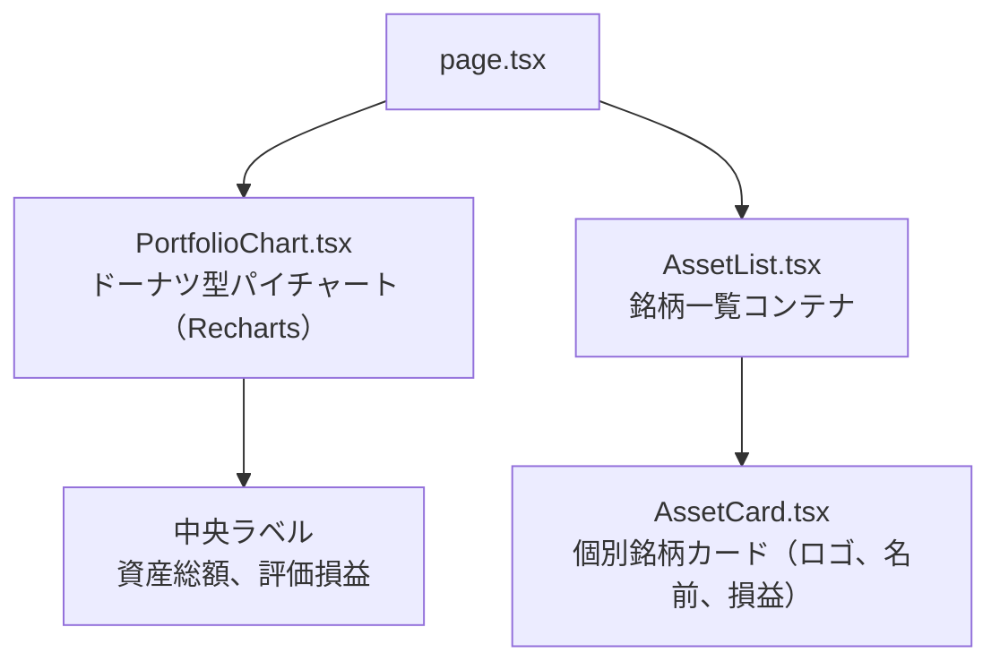

# 作業記録: 株式ポートフォリオビューワー

**プロジェクト**: 顧客の保有株式のポートフォリオを表示する簡易なWebアプリケーション
**ブランチ**: `001-stock-portfolio-viewer`
**開始日**: 2025-12-06

---

## ✅ 完了した作業

### 1. 要件の確認と把握 (2025-12-06)

**実施内容**:
- Notionページへのアクセスをトライしたが、JavaScriptの初期化コードのみが返されアクセス不可
- 代替として`docs/fe-coding.pdf`ファイルを確認
- PDFからフロントエンドエンジニア用コーディング試験の詳細を抽出

**確認した主要要件**:
- Next.js + TypeScriptでSPA構築
- JSONファイル（dummy_response.json）をモックデータとして使用
- ドーナツ型パイチャートでポートフォリオを表示
- 保有銘柄一覧の表示
- クリック/タップでフォーカス機能
- レスポンシブデザイン対応
- テストコード作成
- pnpm install / pnpm dev で起動

### 2. フィーチャーブランチの作成 (2025-12-06)

**実施内容**:
- 短い名前を生成: `stock-portfolio-viewer`
- 既存ブランチを確認（リモート、ローカル、specsディレクトリ）
- 既存の同名ブランチが存在しないことを確認
- `.specify/scripts/bash/create-new-feature.sh`スクリプトを実行

**作成されたリソース**:
- ブランチ名: `001-stock-portfolio-viewer`
- 仕様書パス: `specs/001-stock-portfolio-viewer/spec.md`
- フィーチャー番号: `001`

### 3. 仕様書の作成 (2025-12-06)

**実施内容**:
- `spec-template.md`を読み込んで構造を理解
- PDFの要件を元に詳細な仕様書を作成
- テンプレートに従って以下のセクションを記述:
  - User Scenarios & Testing（4つのユーザーストーリー、優先度付き）
  - Requirements（13件の機能要件、3つのキーエンティティ）
  - Success Criteria（8件の測定可能な成功基準）
  - Edge Cases（6件のエッジケース）
  - Assumptions（9件の前提条件）

### 4. 品質チェックリストの作成と検証 (2025-12-06)

**実施内容**:
- `specs/001-stock-portfolio-viewer/checklists/requirements.md`を作成
- 仕様書の品質検証を実施
- すべてのチェックリスト項目（17項目）が合格

**ステータス**: ✅ プランニング準備完了

### 5. 実装計画の作成 (2025-12-06) ✅ NEW

**実施内容**:
- `/speckit.plan`コマンドを実行
- 技術リサーチを並列で実施（Next.js、チャートライブラリ、テストフレームワーク）
- 以下のドキュメントを作成:

#### 生成された成果物:

| ファイル | 内容 |
|---------|------|
| `research.md` | 技術リサーチ結果と選定理由 |
| `data-model.md` | TypeScript型定義とデータ構造 |
| `quickstart.md` | セットアップ手順とコマンド |
| `contracts/portfolio-schema.json` | JSONスキーマ定義 |
| `contracts/component-contracts.md` | コンポーネントインターフェース |
| `plan.md` | 完全な実装計画 |

#### 技術選定結果:

| カテゴリ | 選定 | 理由 |
|---------|------|------|
| フレームワーク | Next.js 15 (App Router) | 安定版、推奨アーキテクチャ |
| 言語 | TypeScript 5.x | 型安全性、要件 |
| チャート | Recharts | 最小バンドル（45KB）、中央ラベル対応 |
| スタイリング | Tailwind CSS | PDFで許可、高速開発 |
| テスト | Vitest + RTL | Jestより高速、ゼロコンフィグTS |
| リンター | ESLint + Prettier | 業界標準 |

---

## 📋 これから行う作業

### 次のステップ: タスク生成と実装

#### 1. `/speckit.tasks` コマンドの実行

**目的**: 実装計画を元にタスク一覧を生成する

**期待される成果物**:
- `specs/001-stock-portfolio-viewer/tasks.md`
  - 実行可能な具体的タスクのリスト
  - タスク間の依存関係
  - 優先順位付け

#### 2. `/speckit.implement` コマンドの実行

**目的**: タスクを自動的に実装する（または手動実装の開始）

**実装フェーズ**:
1. プロジェクトセットアップ
2. データ層実装（型定義、モックデータ、ユーティリティ）
3. UIコンポーネント実装（パイチャート、銘柄一覧）
4. メインページ統合（状態管理、フォーカス機能）
5. スタイリング＆レスポンシブ
6. テスト＆品質保証

#### 3. 実装完了後の作業

**提出準備**:
- すべてのテストが通ることを確認
- `pnpm install`と`pnpm dev`で動作確認
- Google Chrome最新版で仕様通りに動作することを確認
- Git bundleの作成: `git bundle create <アカウント名>_submission_<日付>.bundle main`

---

## 📁 プロジェクト構造

```
bloomo-task/
├── docs/
│   └── fe-coding.pdf                    # 要件定義書（PDF）
├── specs/
│   └── 001-stock-portfolio-viewer/
│       ├── spec.md                       # 機能仕様書 ✅
│       ├── plan.md                       # 実装計画 ✅
│       ├── research.md                   # 技術リサーチ ✅
│       ├── data-model.md                 # データモデル ✅
│       ├── quickstart.md                 # セットアップガイド ✅
│       ├── checklists/
│       │   └── requirements.md           # 品質チェックリスト ✅
│       ├── contracts/
│       │   ├── portfolio-schema.json     # JSONスキーマ ✅
│       │   └── component-contracts.md    # コンポーネント契約 ✅
│       └── tasks.md                      # タスク一覧（次のステップで作成）
├── CURRENT_WORK.md                       # 本ファイル
├── CLAUDE.md                             # エージェントコンテキスト ✅
└── .specify/
    ├── templates/
    │   └── spec-template.md
    └── scripts/
        └── bash/
            └── create-new-feature.sh
```

---

## 🎯 現在のステータス

**現在のフェーズ**: 実装計画フェーズ完了 → タスク生成・実装フェーズへ移行

**次のアクション**: `/speckit.tasks`コマンドを実行してタスク一覧を生成

**ブロッカー**: なし

**備考**:
- PDFの要件を完全に把握済み
- 仕様書の品質検証済み
- 実装計画と技術選定完了
- dummy_response.jsonはquickstart.mdにサンプルデータを記載済み

---

## 📝 確定した技術スタック

| カテゴリ | 技術 | バージョン |
|---------|------|----------|
| フレームワーク | Next.js | 15.x |
| 言語 | TypeScript | 5.x |
| React | React | 19.x |
| チャート | Recharts | 2.12.x |
| スタイリング | Tailwind CSS | 3.4.x |
| テスト | Vitest | 2.x |
| テスト | React Testing Library | 16.x |
| リンター | ESLint | 9.x |
| フォーマッター | Prettier | 3.x |
| パッケージマネージャー | pnpm | 8.x |

---

## 📐 コンポーネント構成



**状態管理**: React useState（4つの状態）
- portfolio: PortfolioResponse | null
- focusedIndex: number | null
- isLoading: boolean
- error: Error | null

---

**最終更新**: 2025-12-06
**作成者**: AI Assistant (Claude Opus 4.5)
