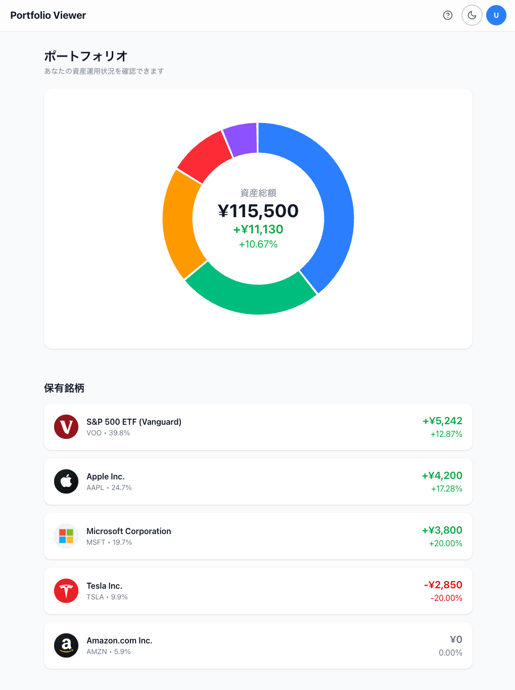

# Stock Portfolio Viewer Mock

顧客の保有株式ポートフォリオを表示する簡易 Web アプリケーションのモック実装です。

## Demo



## Features

- **ポートフォリオ全体像の可視化**: ドーナツ型パイチャートで保有銘柄の構成を表示
- **資産サマリー**: 資産総額、評価損益額、評価損益率をチャート中央に表示
- **銘柄別詳細情報**: 各銘柄のロゴ、名前、ティッカーシンボル、保有比率、評価損益を一覧表示
- **インタラクティブフォーカス**: 銘柄をクリック/タップで選択し、詳細を強調表示
- **レスポンシブデザイン**: PC / タブレット / スマートフォンに対応
- **スケルトンローディング**: データ読み込み中のスムーズな UX

## Tech Stack

| Category        | Technology            |
| --------------- | --------------------- |
| Framework       | Next.js (App Router)  |
| Language        | TypeScript            |
| UI              | React                 |
| Charts          | Recharts              |
| Styling         | Tailwind CSS          |
| Testing         | Vitest                |
| Testing         | React Testing Library |

## Getting Started

### Prerequisites

- Node.js 24.x
- pnpm 10.24.x

### Installation

```bash
# Install dependencies
pnpm install

# Start development server
pnpm dev
```

Open [http://localhost:3000](http://localhost:3000) in your browser.

## Scripts

```bash
pnpm dev          # Start dev server (Turbopack)
pnpm build        # Production build
pnpm start        # Start production server
pnpm lint         # Run ESLint
pnpm lint:fix     # Fix ESLint issues
pnpm format       # Format with Prettier
pnpm test         # Run tests (watch mode)
pnpm test:run     # Run tests (single run)
```

## Project Structure

```text
src/
├── app/
│   ├── _components/    # Page-specific components
│   ├── _hooks/         # Page-specific hooks
│   ├── _types/         # Page-specific types
│   ├── api/            # API Routes
│   ├── layout.tsx
│   ├── page.tsx
│   └── globals.css
├── components/         # Shared components
├── utils/              # Utility functions
└── data/               # Mock data
```

## Documentation

- [Feature Specification](specs/001-stock-portfolio-viewer/spec.md)
- [Implementation Plan](specs/001-stock-portfolio-viewer/plan.md)
- [Speckit Workflow Guide](docs/speckit.md)

## License

MIT
