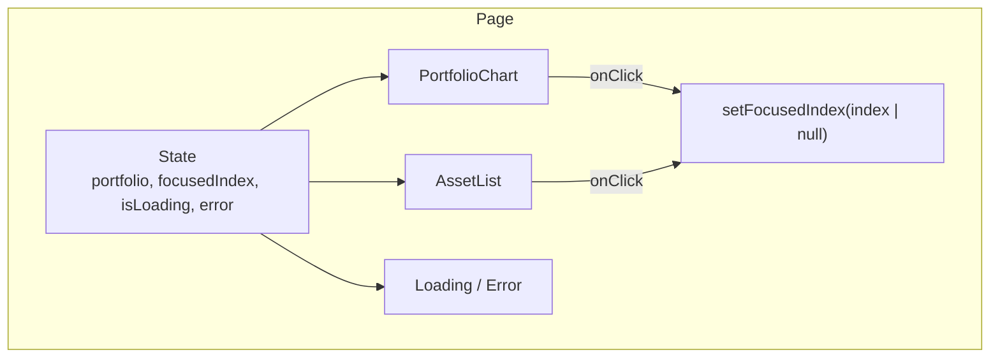

# Component Contracts: 株式ポートフォリオビューワー

**Date**: 2025-12-06
**Feature Branch**: `001-stock-portfolio-viewer`

## Overview

このドキュメントは、React コンポーネント間のインターフェース契約を定義します。

---

## 1. PortfolioChart Component

### Props Interface

```typescript
interface PortfolioChartProps {
  /** ポートフォリオデータ */
  data: PortfolioResponse;

  /** フォーカス中の銘柄インデックス（null = フォーカスなし） */
  focusedIndex: number | null;

  /** 銘柄クリック時のコールバック */
  onSegmentClick: (index: number) => void;

  /** フォーカス解除時のコールバック */
  onClearFocus: () => void;
}
```

### Behavior Contract

| イベント | トリガー | 期待される動作 |
|---------|---------|--------------|
| セグメントクリック | ユーザーがパイチャートのセグメントをクリック/タップ | `onSegmentClick(index)` を呼び出す |
| 中央クリック | ユーザーがパイチャートの中央をクリック | `onClearFocus()` を呼び出す |
| フォーカス変更 | `focusedIndex` プロップの変更 | 該当セグメントを強調、他を半透過 |

### Rendering Contract

- **12時起点**: `startAngle={90}` で12時位置からスタート
- **時計回り**: 保有比率の大きい順に時計回りに配置
- **中央表示**（ワイヤーフレーム準拠）:
  - 1行目: 資産総額（例: ¥115,500）
  - 2行目: 評価損益（例: +15.5%(¥15,500)）← 率と額を併記
- **色分け**: 評価損益に応じて緑/赤/グレーで表示

---

## 2. AssetList Component

### Props Interface

```typescript
interface AssetListProps {
  /** 保有銘柄のリスト */
  assets: HoldingAsset[];

  /** フォーカス中の銘柄インデックス（null = フォーカスなし） */
  focusedIndex: number | null;

  /** 銘柄クリック時のコールバック */
  onAssetClick: (index: number) => void;
}
```

### Behavior Contract

| イベント | トリガー | 期待される動作 |
|---------|---------|--------------|
| 銘柄クリック | ユーザーが銘柄カードをクリック/タップ | `onAssetClick(index)` を呼び出す |
| フォーカス変更 | `focusedIndex` プロップの変更 | 該当銘柄を通常表示、他を半透過 |

### Rendering Contract

- **表示順序**: `holding_ratio` の降順
- **各銘柄の表示項目**（ワイヤーフレーム準拠）:
  - ロゴ画像（エラー時はティッカーシンボルのテキスト）
  - 銘柄名（例: S&P500 ETF(Vanguard)）
  - ティッカーシンボル / 保有比率（例: VOO / 39.8%）
  - 保有金額（例: ¥45,969）
  - 評価損益（例: +12.87%(¥5,242)）← 率と額を併記
- **色分け**: 評価損益に応じて緑/赤/グレーで表示

**レイアウト例**:
```
[ロゴ] S&P500 ETF(Vanguard)    ¥45,969
       VOO / 39.8%             +12.87%(¥5,242)
```

---

## 3. AssetCard Component

### Props Interface

```typescript
interface AssetCardProps {
  /** 銘柄情報 */
  asset: HoldingAsset;

  /** パイチャートと連動する色 */
  chartColor: string;

  /** フォーカス状態 */
  isFocused: boolean;

  /** 半透過状態（他の銘柄がフォーカスされている） */
  isDimmed: boolean;

  /** クリック時のコールバック */
  onClick: () => void;
}
```

### Behavior Contract

| イベント | トリガー | 期待される動作 |
|---------|---------|--------------|
| カードクリック | ユーザーがカードをクリック/タップ | `onClick()` を呼び出す |

### Rendering Contract

- **通常状態**: `opacity: 1`
- **半透過状態**: `opacity: 0.3`
- **フォーカス状態**: 通常状態と同じ（強調表示オプション可）

---

## 4. Main Page Component

### State Management

```typescript
// src/app/page.tsx

const [portfolio, setPortfolio] = useState<PortfolioResponse | null>(null);
const [isLoading, setIsLoading] = useState(true);
const [error, setError] = useState<Error | null>(null);
const [focusedIndex, setFocusedIndex] = useState<number | null>(null);
```

### Data Flow



### Event Handlers

```typescript
// セグメント/銘柄クリック
const handleAssetClick = (index: number) => {
  if (focusedIndex === index) {
    setFocusedIndex(null); // 同じ銘柄をクリック → フォーカス解除
  } else {
    setFocusedIndex(index); // 新しい銘柄をフォーカス
  }
};

// フォーカス解除
const handleClearFocus = () => {
  setFocusedIndex(null);
};
```

---

## 5. Color Palette Contract

### Chart Colors

パイチャートの各セグメントには、以下のカラーパレットを使用:

```typescript
const CHART_COLORS = [
  '#3B82F6', // blue-500
  '#10B981', // emerald-500
  '#F59E0B', // amber-500
  '#EF4444', // red-500
  '#8B5CF6', // violet-500
  '#EC4899', // pink-500
  '#06B6D4', // cyan-500
  '#F97316', // orange-500
];
```

### Gain/Loss Colors

```typescript
const GAIN_COLORS = {
  positive: '#22C55E', // green-500
  negative: '#EF4444', // red-500
  zero: '#6B7280',     // gray-500
};
```

---

## 6. Responsive Breakpoints

### Tailwind CSS Breakpoints

| ブレークポイント | サイズ | 用途 |
|-----------------|-------|------|
| `sm` | 640px | スマートフォン横向き |
| `md` | 768px | タブレット |
| `lg` | 1024px | デスクトップ |

### Layout Contract

- **モバイル (< 640px)**:
  - パイチャート: 幅100%、最大280px
  - 銘柄一覧: 縦スタック

- **タブレット (640px - 1023px)**:
  - パイチャート: 幅100%、最大360px
  - 銘柄一覧: 縦スタック

- **デスクトップ (>= 1024px)**:
  - パイチャート: 幅400px
  - 銘柄一覧: 縦スタック
