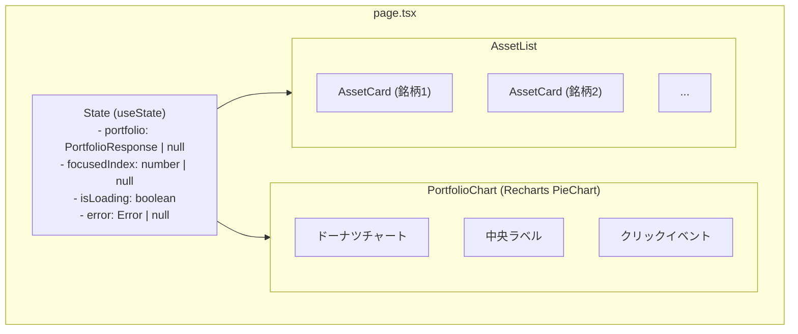
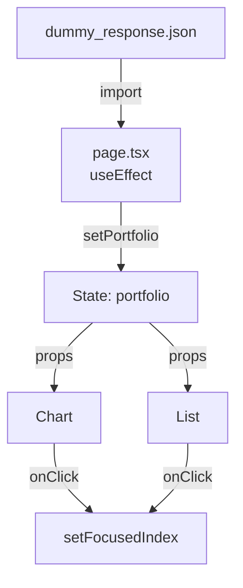
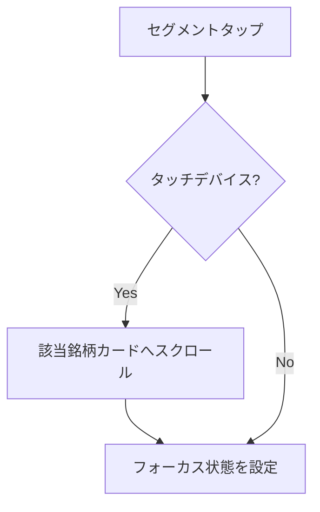

# Implementation Plan: 株式ポートフォリオビューワー

**Branch**: `001-stock-portfolio-viewer` | **Date**: 2025-12-06 | **Spec**: [spec.md](./spec.md)
**Input**: Feature specification from `/specs/001-stock-portfolio-viewer/spec.md`

## Summary

顧客の保有株式のポートフォリオを表示する簡易なWebアプリケーション。Next.js 16とTypeScriptを使用したSPAで、Rechartsによるドーナツ型パイチャートと銘柄一覧を表示。フォーカス機能とレスポンシブデザインに対応。

## Technical Context

**Language/Version**: TypeScript 5.x / React 19.2
**Framework**: Next.js 16 (App Router)
**Primary Dependencies**: Recharts, Tailwind CSS v4.0
**Storage**: N/A（モックJSONファイルを使用）
**Testing**: Vitest + React Testing Library
**Target Platform**: Web (PC / Mobile)
**Project Type**: web (SPA)
**Performance Goals**: 初期表示3秒以内、60fps インタラクション
**Constraints**: Google Chrome最新版のみサポート、pnpm 10.x、Node.js 24.x（Volta管理）
**Scale/Scope**: シングルページ、5-10銘柄のモックデータ

## Constitution Check

*GATE: Must pass before Phase 0 research. Re-check after Phase 1 design.*

**Pre-Phase 0 Check**: ✅ PASSED
- コンスティテューションはテンプレート状態（プロジェクト固有のルールなし）
- 一般的なベストプラクティスに従う

**Post-Phase 1 Check**: ✅ PASSED
- シンプルなアーキテクチャ（単一ページ、クライアントサイドレンダリング）
- 不必要な複雑さの排除（状態管理ライブラリ不要、React useStateで十分）
- テスト駆動開発の原則に従う

## Project Structure

### Documentation (this feature)

```text
specs/001-stock-portfolio-viewer/
├── plan.md              # This file
├── spec.md              # Feature specification
├── research.md          # Technology research and decisions
├── data-model.md        # TypeScript types and data structures
├── quickstart.md        # Setup and development guide
├── contracts/           # Schema and component contracts
│   ├── portfolio-schema.json
│   └── component-contracts.md
├── checklists/
│   └── requirements.md  # Spec quality checklist
└── tasks.md             # Implementation tasks (created by /speckit.tasks)
```

### Source Code (repository root)

```text
src/
├── app/
│   ├── layout.tsx           # ルートレイアウト（メタデータ、フォント）
│   ├── page.tsx             # メインページコンポーネント
│   └── globals.css          # Tailwind CSSのグローバルスタイル
├── components/
│   ├── PortfolioChart.tsx   # ドーナツ型パイチャート（Recharts）
│   ├── AssetList.tsx        # 銘柄一覧コンテナ
│   └── AssetCard.tsx        # 個別銘柄カード
├── types/
│   └── portfolio.ts         # TypeScript型定義
├── utils/
│   └── formatters.ts        # 数値フォーマットユーティリティ
└── data/
    └── dummy_response.json  # モックデータ

__tests__/
├── components/
│   ├── PortfolioChart.test.tsx
│   ├── AssetList.test.tsx
│   └── AssetCard.test.tsx
└── utils/
    └── formatters.test.ts

# 設定ファイル（ルート）
├── vitest.config.ts         # Vitestテスト設定
├── vitest.setup.ts          # テストセットアップ
├── tailwind.config.ts       # Tailwind CSS設定
├── tsconfig.json            # TypeScript設定
├── eslint.config.mjs        # ESLint設定
└── .prettierrc              # Prettier設定
```

**Structure Decision**: Web application (frontend-only SPA). Next.js App Routerを使用した単一ページアプリケーション。バックエンドは不要（モックデータを使用）。

## Component Architecture



## Key Technical Decisions

### 1. チャートライブラリ: Recharts

**理由**:
- 最小バンドルサイズ（45KB gzipped）
- 中央ラベルのネイティブサポート
- シンプルなクリックイベントハンドリング
- 完全なTypeScript型定義

### 2. スタイリング: Tailwind CSS

**理由**:
- PDFで明示的に許可
- 高速なレスポンシブデザイン開発
- PurgeCSSによるバンドル最適化

### 3. テスト: Vitest + React Testing Library

**理由**:
- Jestより2-10倍高速
- ゼロコンフィグTypeScriptサポート
- コンポーネントテストに最適

### 4. 状態管理: React useState

**理由**:
- シンプルなSPAには十分
- 追加ライブラリ不要
- 4つの状態のみ管理

## Data Flow



## Responsive Design Strategy

| 画面サイズ | チャートサイズ | レイアウト |
|-----------|--------------|----------|
| < 640px (モバイル) | 280px | 縦スタック |
| 640-1023px (タブレット) | 360px | 縦スタック |
| >= 1024px (デスクトップ) | 400px | 縦スタック |

## Complexity Tracking

> このプロジェクトは単純なSPAであり、複雑さの正当化は不要。

| 項目 | 選択 | 理由 |
|-----|------|------|
| 状態管理 | useState | Redux/Zustandは過剰 |
| データ取得 | 静的import | APIクライアント不要 |
| スタイリング | Tailwind | CSS-in-JS より軽量 |
| テスト | Vitest | Jest より高速 |

## Implementation Phases

### Phase 1: プロジェクトセットアップ
- Next.js プロジェクト初期化
- 依存パッケージインストール
- 設定ファイル作成
- ディレクトリ構造作成

### Phase 2: データ層実装
- TypeScript型定義
- モックデータ配置
- フォーマットユーティリティ
- ユニットテスト

### Phase 3: UIコンポーネント実装
- PortfolioChart（パイチャート）
- AssetCard（銘柄カード）
- AssetList（銘柄一覧）
- コンポーネントテスト

### Phase 4: メインページ統合
- page.tsx実装
- 状態管理
- フォーカス機能
- エラーハンドリング

### Phase 5: スタイリング＆レスポンシブ
- Tailwind CSSスタイル
- レスポンシブデザイン
- アニメーション（オプション）

### Phase 6: テスト＆品質保証
- 全テスト実行
- リンター/フォーマッター確認
- ブラウザ動作確認
- 最終調整

## タッチデバイス対応設計

### タッチデバイス検出

タッチデバイスとPCで異なるUXを提供するため、`useTouchDevice`カスタムフックを作成する。

```typescript
// src/app/_hooks/useTouchDevice.ts
export function useTouchDevice(): boolean {
  // SSR時はfalseを返す
  // クライアント側でnavigator.maxTouchPointsをチェック
}
```

**検出ロジック**:
- `navigator.maxTouchPoints > 0` でタッチデバイスを判定
- SSR時は`false`（非タッチデバイス）として扱う

### チャートセグメントタップ時のスクロール



**実装箇所**: `PortfolioInteractive.tsx`

**スクロール処理**:
```typescript
const scrollToAssetCard = (index: number) => {
  const card = document.querySelector(`[data-asset-index="${index}"]`);
  card?.scrollIntoView({ behavior: 'smooth', block: 'center' });
};
```

### 銘柄カードのdata属性

`AssetCard`コンポーネントに`data-asset-index`属性を追加し、スクロールターゲットとして使用する。

```tsx
// AssetCard.tsx
<div
  data-testid="asset-card"
  data-asset-index={index}
  ...
>
```

### ツールチップ表示の条件変更

現在の実装（ブレークポイントによる判定）をタッチデバイス検出に変更する。

**変更前**: `breakpoint !== 'mobile'`
**変更後**: `!isTouchDevice`

## Related Documents

- [spec.md](./spec.md) - 機能仕様書
- [research.md](./research.md) - 技術リサーチ
- [data-model.md](./data-model.md) - データモデル
- [quickstart.md](./quickstart.md) - セットアップガイド
- [contracts/](./contracts/) - スキーマと契約
